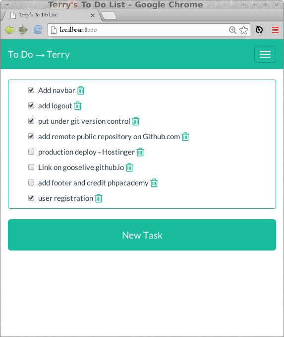
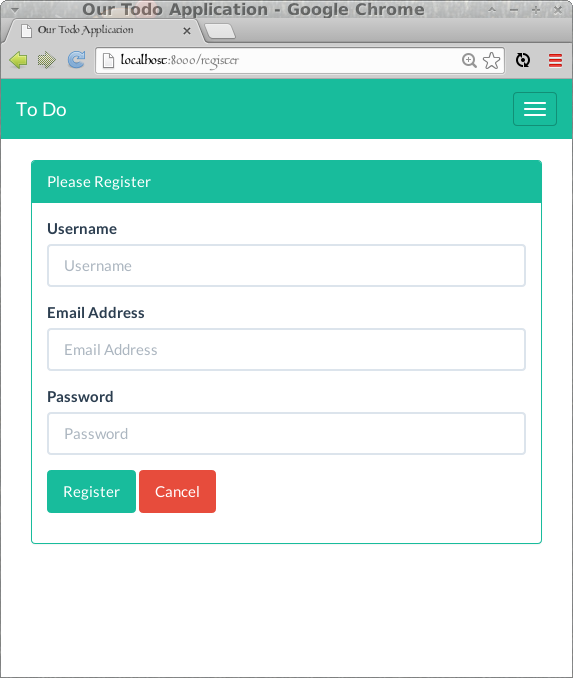
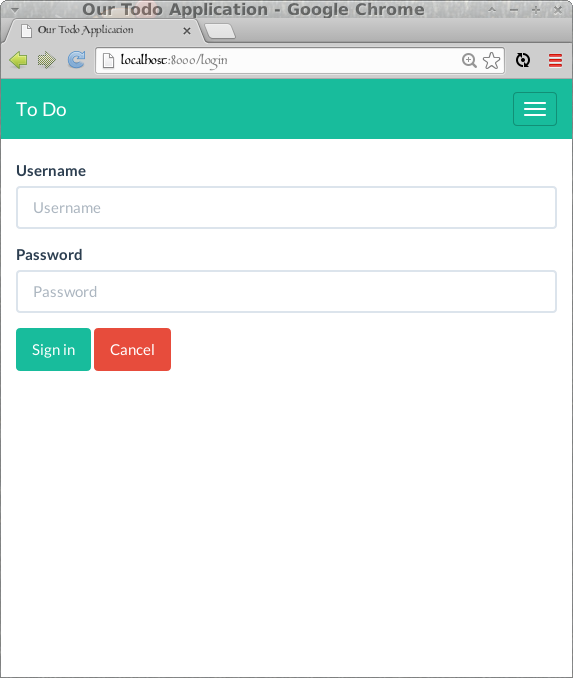
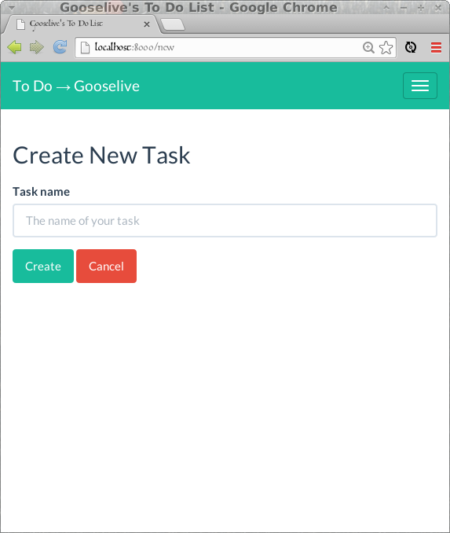

## To Do List Application

A simple To Do list developed in Laravel 4.2.8

Features user registration and authentication, Bootstrap theming - responsive css.

### Credits
#### Laravel PHP Framework

Documentation for the entire framework can be found on the [Laravel website](http://laravel.com/docs).

##### [Laravel To Do List App by phpacademy](https://www.youtube.com/playlist?list=PLfdtiltiRHWGH8AngyP6cp525_R_NExcR)
##### [How to Laravel series: Let's talk Gulp - © Christoph Rumpel 2014](http://christoph-rumpel.com/2014/02/how-to-laravel-series-lets-talk-gulp/)
##### [Laravel 4 Simple Blog by fallendown2005](https://www.youtube.com/playlist?list=PLLJSbW-UxRIwkhnNHaxPWrHhRmBgQ4T-Q)